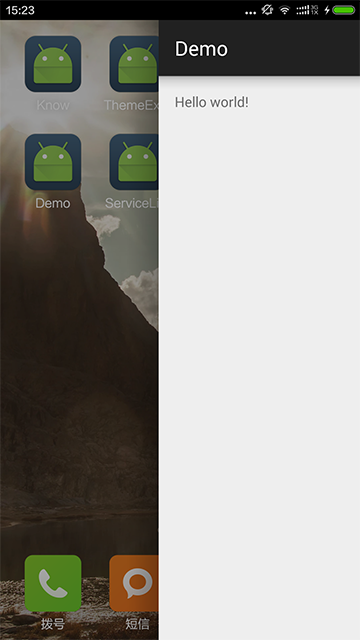

# SwipeBackHelper  Activity滑动关闭
代码修改自[SwipeBackLayout](https://github.com/ikew0ng/SwipeBackLayout)  
去掉了左滑上滑等不常用功能。  
将滑动部分与Activity解耦.在自己的Activity中3个生命周期中加一行代码即可
解决可设置滑动范围只有半个屏幕的限制。   

##依赖
`compile 'com.jude:swipebackhelper:1.1.0'`

##配置
在`style.xml`中添加`<item name="android:windowIsTranslucent">true</item>`
在你的Activity中添加一下几个生命周期，即可。

    @Override
    protected void onCreate(Bundle savedInstanceState) {
        super.onCreate(savedInstanceState);
        SwipeBackHelper.onCreate(this);
    }

    @Override
    protected void onPostCreate(Bundle savedInstanceState) {
        super.onPostCreate(savedInstanceState);
        SwipeBackHelper.onPostCreate(this);
    }

    @Override
    protected void onDestroy() {
        super.onDestroy();
        SwipeBackHelper.onDestroy(this);
    }

